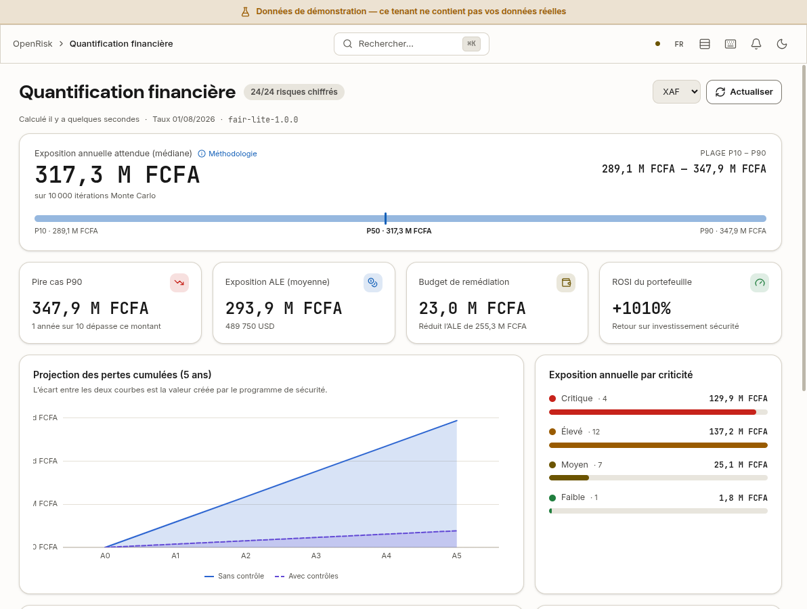

<div align="center">
  
  
  # OpenRisk
  
  **Enterprise-Grade Risk Management Platform**
  
  Part of the [OpenDefender](https://github.com/opendefender) Ecosystem

  [](LICENSING.md)
  [](https://github.com/opendefender/OpenRisk/releases)
  [](https://github.com/opendefender/OpenRisk/actions)
  [](https://golang.org)
  [](https://react.dev)
</div>

---

## 🎬 Demo Visuelle


*Pour voir la démonstration complète en vidéo, consultez la section "Support & Contact" ci-dessous.*

---

## 🎯 Vue d'ensemble

**OpenRisk** is a modern, enterprise-grade **Risk Management Platform** that transforms how organizations identify, assess, mitigate, and monitor risks. Built with a scalable microservices architecture, OpenRisk enables teams to move beyond spreadsheets and legacy systems into a seamless, automated risk management experience.

### 🎯 What OpenRisk Enables

OpenRisk allows every organization to:
- ✅ **Identify** IT & security risks
- ✅ **Score & Prioritize** risks based on impact and probability
- ✅ **Track** mitigation plans and action items
- ✅ **Monitor** trends in real-time with interactive dashboards

### 💡 Designed For

- **CTO & CISO** - Strategic risk oversight and compliance
- **DevSecOps** - Integrated security in CI/CD pipelines
- **Security Analysts** - Risk assessment and investigation
- **Compliance Teams** - Audit trails and governance

### 📈 Key Advantages

- ⚡ **Automated Risk Assessment** - Reduce manual evaluation time
- 📊 **Interactive Dashboards** - Real-time risk visualization
- 🐳 **Easy Deployment** - Docker & Kubernetes ready
- 🔐 **Enterprise Security** - RBAC, SSO, audit logging
- 📈 **Scalable Architecture** - Microservices-ready

### Key Capabilities
- 🎲 **Risk Assessment** - Comprehensive risk identification and scoring
- 🛡️ **Mitigation Tracking** - Monitor and track risk mitigations in real-time
- 🔐 **Enterprise Security** - RBAC, audit logging, OAuth2/SAML2 SSO
- 🗂️ **Asset Inventory** - Track assets, their criticality and dependencies
- 📋 **Compliance Management** - Manage controls, evidence and compliance reports
- 💶 **Financial Risk Quantification** - Quantify exposure using SLE, ARO, ALE and ROSI

### 💶 Financial Risk Quantification (CRQ)



*The Financial Quantification dashboard (`/analytics/financial`), shown on the built-in
demonstration dataset (`DEMO_MODE=true`), not on a customer's data. Available from the
**Pro** plan.*

Each risk is quantified FAIR-style: single loss expectancy (SLE), annual rate of occurrence
(ARO), annualised loss expectancy (ALE = SLE × ARO), residual ALE and return on security
investment (ROSI). Amounts are computed in XAF and presented in XAF, XOF, EUR, USD, NGN, MAD,
GHS or ZAR. The dashboard aggregates them into one view for the CFO and the CISO
(`backend/pkg/crq`).

### 🌍 African Regulatory Catalogues

| Catalogue | Source instrument | Controls |
|---|---|---|
| **COBAC (CEMAC)**: internal control of credit institutions | Règlement COBAC R-2016/04 | 45 |
| **BCEAO / UEMOA**: payment systems | Règlement n°15/2002/CM/UEMOA | 35 |
| **ANTIC (Cameroon)**: cybersecurity | Loi n°2010/012 | 25 |

Every control cites the article it derives from (`backend/pkg/compliance/catalog_*.go`). The
control descriptions are synthesised rewordings, not the regulatory text. Have them reviewed
by a qualified professional before relying on them in a real audit.

### 🔎 Asset Discovery

**10 collectors**: AWS, Azure, Google Cloud, Kubernetes, Docker, VMware vCenter, Active
Directory, Microsoft 365, GitHub and GitLab. **Plus an on-premise Agent** (nmap) for networks
the platform cannot reach directly (`backend/internal/scanner`).

---

## 🚀 Quick Start (5 Minutes)

### Prerequisites
- Docker & Docker Compose
- Git
- 4GB RAM, 2GB disk space

### Self-hosting — one command

```bash
git clone https://github.com/opendefender/OpenRisk.git
cd OpenRisk
./install.sh
```

That is the whole procedure. The installer generates the RS256 keypair and every
secret, starts PostgreSQL, Redis, the API and the frontend, waits for health, and
**prints the credentials of the administrator it created**:

```
[openrisk] ✅ OpenRisk is up.
[openrisk]    • App:  http://localhost:3000
[openrisk]    • API:  http://localhost:8080/api/v1
[openrisk] Sign in with:
[openrisk]    • Email:    admin@opendefender.io
[openrisk]    • Password: <32 random characters, different on every install>
```

No file is edited by hand at any point. Re-running the installer keeps your
configuration, your keys and that account.

A CI job ([`selfhost-install.yml`](.github/workflows/selfhost-install.yml)) runs
this flow monthly on a fresh Ubuntu 24.04 VM and signs in with the printed
credentials. It has **not yet had a green run** — the defects that kept it red
are fixed in #328; the flow was verified by hand on a clean stack on 2026-09-09.

Full guide, including what a self-hosted instance is entitled to, upgrades and
backups: **[docs/SELF_HOSTING.md](docs/SELF_HOSTING.md)**.

### Local development

Working on OpenRisk itself (hot reload, test databases, seeded fixtures) is a
different setup: see **[docs/LOCAL_DEVELOPMENT.md](docs/LOCAL_DEVELOPMENT.md)**.

### ⚠️ Security: no default credentials

OpenRisk ships no default password. The first administrator gets the
`INITIAL_ADMIN_PASSWORD` you set, or one generated on first boot and written
to a `0600` file, never to the logs (see [docs/SELF_HOSTING.md](docs/SELF_HOSTING.md#the-first-administrator)).
The compose files refuse to start without their database and cache passwords.

An instance first started before this change may still have `admin123` on
`admin@opendefender.io`: the backend logs a `SECURITY WARNING` at boot until
the password is changed.

To report a vulnerability, see [SECURITY.md](SECURITY.md).

**Password Requirements** (enforced server-side at registration):
- Minimum 12 characters
- At least three of: lowercase, uppercase, digits, symbols
- Common and predictable passwords are rejected
- Preferably generated with a password manager (1Password, Bitwarden, etc.)

---

## 🛠 Technical Stack

### Backend
| Component | Technology | Version |
|-----------|-----------|---------|
| **Language** | Go | 1.25.4 |
| **Framework** | Fiber | v2.52 |
| **Database** | PostgreSQL | 16 |
| **ORM** | GORM | v1.31 |
| **Testing** | Testify | v1.11 |
| **Architecture** | CLEAN | Domain-Driven |

### Frontend
| Component | Technology | Version |
|-----------|-----------|---------|
| **Framework** | React | 19.2.0 |
| **State** | Zustand | 5.0.8 |
| **Styling** | Tailwind CSS | 3.4.0 |
| **Forms** | React Hook Form | 7.66 |
| **Routing** | React Router | 7.9.6 |
| **Charts** | Recharts | 3.5.0 |

### Infrastructure
| Component | Technology | Purpose |
|-----------|-----------|---------|
| **Containerization** | Docker | Application packaging |
| **Orchestration** | Kubernetes | Production deployment |
| **Charts** | Helm | K8s configuration |
| **CI/CD** | GitHub Actions | Automated testing & deployment |
| **Caching** | Redis | Session & cache layer |

---

## 📋 Features

The following capabilities are available in the product today:

- Authentication, role-based access control and API token management
- Risk register, scoring, lifecycle management and mitigation tracking
- Asset inventory, criticality and dependency mapping
- Compliance frameworks, controls, evidence and PDF reporting
- Incident register, incident timeline and source ingestion
- Vulnerability management and asset discovery
- Financial risk quantification (FAIR-style SLE, ARO, ALE and ROSI) †
- Vendor risk management: vendor register, questionnaires, assessments and reminders †
- Governance workflows, immutable audit records, delegations and approvals
- Security automation rules, SLA tracking and notification workflows

† Gated by plan. A self-hosted install starts on the **Free** plan, which does not
unlock these. The plans and what each one grants are described in
[`docs/PRICING.md`](docs/PRICING.md); the enforced matrix lives in
[`backend/pkg/entitlements/entitlements.go`](backend/pkg/entitlements/entitlements.go).

The detailed delivery status and its supporting evidence are maintained in
[`ROADMAP.md`](ROADMAP.md). A capability is listed here only when it is available to a
user; planned work belongs in the roadmap below.

---

## 📚 Documentation

| Document | Purpose |
|----------|---------|
| [TESTING_GUIDE.md](docs/TESTING_GUIDE.md) | Complete testing procedures & execution guide |
| [TESTING_COMPLETION_SUMMARY.md](docs/TESTING_COMPLETION_SUMMARY.md) | Phase 5 testing overview & metrics |
| [OPTIMIZATION_REPORT.md](docs/OPTIMIZATION_REPORT.md) | Performance optimization strategies & analysis |
| [PERFORMANCE_TESTING.md](docs/PERFORMANCE_TESTING.md) | k6 load testing configuration & guide |
| [LOCAL_DEVELOPMENT.md](docs/LOCAL_DEVELOPMENT.md) | Setup guide for development environment |
| [API_REFERENCE.md](docs/API_REFERENCE.md) | Complete API endpoint documentation |
| [KUBERNETES_DEPLOYMENT.md](docs/KUBERNETES_DEPLOYMENT.md) | K8s deployment instructions |
| [PRODUCTION_RUNBOOK.md](docs/PRODUCTION_RUNBOOK.md) | Production operations guide |
| [SAML_OAUTH2_INTEGRATION.md](docs/SAML_OAUTH2_INTEGRATION.md) | SSO integration guide |
| [ADVANCED_PERMISSIONS.md](docs/ADVANCED_PERMISSIONS.md) | RBAC & permissions documentation |

For more documentation, see the [docs](docs/) directory.

---

## 🚀 Deployment

### Local Development
```bash
docker compose up -d
```

### Staging Environment
```bash
# See docs/STAGING_DEPLOYMENT.md
./scripts/deploy-kubernetes.sh --environment staging
```

### Production Deployment
```bash
# See docs/PRODUCTION_RUNBOOK.md
helm install openrisk ./helm/openrisk \
  -f helm/values-prod.yaml \
  --namespace openrisk
```

---

## 🧪 Testing & Quality Assurance

### Test Suites Available

**Integration Tests** - Database-level testing with PostgreSQL & Redis
```bash
go test -v ./tests/integration_test.go -timeout 30m
```
- 8 test cases covering CRUD, relationships, concurrency
- Query performance validation
- Audit logging verification

**E2E Tests** - User workflows in real browsers with Playwright
```bash
npx playwright test [--headed] [--project=chromium|firefox|webkit]
npx playwright show-report
```
- 12+ test scenarios across 5 browsers/viewports
- Authentication, risk management, custom fields
- Mobile responsiveness (iPhone 12, Pixel 5)
- Performance metrics validation

**Security Tests** - Vulnerability scanning and protection verification
```bash
go test -v ./tests/security_test.go -timeout 30m
```
- CSRF protection, SQL injection prevention
- XSS protection, rate limiting, auth bypass detection
- Security headers validation, CORS verification

**Performance Benchmarks** - Throughput and latency measurements
```bash
go test -v -bench=. ./tests/performance_benchmark_test.go -timeout 30m
```
- 9 benchmarks covering all critical operations
- Cache vs database performance comparison
- Concurrent operation handling

**Docker Compose Testing** - Isolated test environment
```bash
docker-compose -f docker-compose.test.yaml up -d
docker-compose -f docker-compose.test.yaml run integration_tests
docker-compose -f docker-compose.test.yaml run security_tests
docker-compose -f docker-compose.test.yaml run performance_tests
docker-compose -f docker-compose.test.yaml run e2e_tests
docker-compose -f docker-compose.test.yaml down -v
```

### Test Statistics
- **30+ test cases** across all test suites
- **2,707 lines** of test code
- **11 security categories** (OWASP coverage)
- **9 performance benchmarks** (all targets met)
- **5 browser/viewport combinations**

See [TESTING_GUIDE.md](docs/TESTING_GUIDE.md) and [TESTING_COMPLETION_SUMMARY.md](docs/TESTING_COMPLETION_SUMMARY.md) for detailed testing documentation.

---

## 📊 API Overview

OpenRisk provides a comprehensive REST API with 37+ endpoints:

### Core Endpoints
```
POST   /api/risks              - Create risk
GET    /api/risks              - List risks
GET    /api/risks/:id          - Get risk details
PATCH  /api/risks/:id          - Update risk
DELETE /api/risks/:id          - Delete risk

POST   /api/mitigations        - Create mitigation
GET    /api/mitigations        - List mitigations
PATCH  /api/mitigations/:id    - Update mitigation

POST   /api/mitigations/:id/sub-actions    - Add checklist item
PATCH  /api/mitigations/:id/sub-actions/:aid - Toggle completion
```

### RBAC & Security
```
POST   /auth/login             - JWT authentication
POST   /auth/register          - User registration
POST   /auth/oauth2/:provider  - OAuth2 login
POST   /auth/saml/acs          - SAML assertion endpoint

GET    /api/tokens             - List API tokens
POST   /api/tokens             - Create new token
DELETE /api/tokens/:id         - Revoke token

GET    /rbac/roles             - List roles
POST   /rbac/roles             - Create role
PUT    /rbac/roles/:id         - Update role
DELETE /rbac/roles/:id         - Delete role
GET    /rbac/permissions       - List permissions

GET    /rbac/tenants           - List tenants
POST   /rbac/tenants           - Create tenant
GET    /rbac/tenants/:id/stats - Tenant statistics
DELETE /rbac/tenants/:id       - Delete tenant
```

### Analytics & Reporting
```
GET    /api/analytics/dashboard     - Dashboard metrics
GET    /api/analytics/trends        - Risk trends
GET    /api/reports                 - List reports
POST   /api/reports/export          - Export risks/mitigations
```

See [API_REFERENCE.md](docs/API_REFERENCE.md) for complete endpoint documentation with examples.

---

## 🔐 Security

OpenRisk implements enterprise-grade security:

- **Authentication**: JWT tokens (RS256) with expiration and JTI blacklist
- **Authorization**: RBAC with permission matrices and resource-level granularity
- **Password Hashing**: Argon2id (m=64MB, t=3, p=4) - never SHA256 or bcrypt alone
- **Encryption**: AES-256-GCM for sensitive data at rest
- **Audit Trail**: Complete audit logging for all operations (append-only)
- **SSO**: OAuth2 (Google, GitHub) and SAML2 support
- **Rate Limiting**: Per-IP and per-tenant quotas across the API, with a stricter throttle on credential endpoints
- **Security Headers**: CSP, HSTS, X-Frame-Options, Referrer-Policy and nosniff
- **Input Validation**: Server-side request validation (go-playground/validator); Zod on the frontend
- **Default Credentials**: Never hardcoded - always use environment variables
- **Secrets Management**: Support for external secret managers (Vault, AWS Secrets Manager)

⚠️ **Security Best Practices:**
- Rotate credentials and API keys regularly
- Use strong passwords (12+ characters, mixed case, numbers, symbols)
- Enable MFA/2FA for all user accounts
- Keep dependencies updated regularly
- Run security scans (TruffleHog, Snyk, Trivy)
- Monitor audit logs for suspicious activity

See [ADVANCED_PERMISSIONS.md](docs/ADVANCED_PERMISSIONS.md) and [SECURITY.md](SECURITY.md) for detailed security documentation.

---

## ⌨️ Keyboard Shortcuts

OpenRisk includes keyboard shortcuts to help you work faster. Below is a complete list of available shortcuts:

### Global Shortcuts
| Shortcut | Action | Context |
|----------|--------|---------|
| <kbd>⌘K</kbd> or <kbd>Ctrl+K</kbd> | Open global search | Anywhere in the app |
| <kbd>⌘N</kbd> or <kbd>Ctrl+N</kbd> | Create new risk | Dashboard and Risks page |
| <kbd>Esc</kbd> | Close modal/dialog | Any open modal or dialog |

### Search & Navigation
| Shortcut | Action | Context |
|----------|--------|---------|
| <kbd>↑</kbd> | Previous search result | In search suggestions |
| <kbd>↓</kbd> | Next search result | In search suggestions |
| <kbd>Enter</kbd> | Select search result | Search suggestions open |
| <kbd>Esc</kbd> | Close search dropdown | Search suggestions open |

### Risk Management
| Shortcut | Action | Context |
|----------|--------|---------|
| <kbd>Esc</kbd> | Close risk details | Risk details panel open |
| <kbd>Esc</kbd> | Close edit modal | Risk editing modal open |

### Tips for Power Users

- **Search Tip**: Use <kbd>⌘K</kbd> / <kbd>Ctrl+K</kbd> from anywhere to quickly search for risks, assets, or mitigations
- **Quick Create**: Press <kbd>⌘N</kbd> / <kbd>Ctrl+N</kbd> on the dashboard to rapidly create new risks
- **Navigation**: Use arrow keys in search results to navigate without your mouse
- **Mobile**: These shortcuts work best on desktop/laptop keyboards

### Planned Shortcuts (Coming Soon)
- **Edit Last Risk** - <kbd>⌘E</kbd> / <kbd>Ctrl+E</kbd>
- **Filter Results** - <kbd>⌘F</kbd> / <kbd>Ctrl+F</kbd>
- **Delete Selected** - <kbd>⌘D</kbd> / <kbd>Ctrl+D</kbd>
- **Focus Search** - <kbd>/</kbd> key
- **Settings** - <kbd>⌘,</kbd> / <kbd>Ctrl+,</kbd>

---

## 🤝 Contributing

We welcome contributions from the community! Please see [CONTRIBUTING.md](CONTRIBUTING.md) for guidelines.

### Development Workflow
1. Fork the repository
2. Create a feature branch (`git checkout -b feature/AmazingFeature`)
3. Commit your changes (`git commit -m 'Add AmazingFeature'`)
4. Push to the branch (`git push origin feature/AmazingFeature`)
5. Open a Pull Request

---

## 📝 License

OpenRisk is **open-core**:

- **Community Edition** (the core GRC platform) — **GNU AGPL v3.0** ([`LICENSE`](LICENSE)).
  Free to self-host, study, modify and redistribute. The AGPL's network clause
  means anyone running a **modified** core as a hosted service must publish their
  changes under the AGPL.
- **Enterprise Edition** (advanced SSO, AI copilot, premium connectors & SOAR,
  multi-organisation management) — **OpenRisk Commercial License**
  ([`LICENSE.commercial`](LICENSE.commercial)), used under a paid subscription.
- **The design system** (`frontend/design-system/` and `frontend/src/shared/ds/`)
  — **Apache License 2.0** ([`frontend/design-system/LICENSE`](frontend/design-system/LICENSE)).
  Deliberately permissive: the tokens and primitives are meant to be copied and
  extended, including by commercial code. Attribution lives in
  [`NOTICE`](frontend/design-system/NOTICE). Apache-2.0 grants no trademark
  rights — the OpenRisk and OpenDefender names and logos are not licensed by it.

Every source file declares its edition via its `SPDX-License-Identifier` header
(`AGPL-3.0-only`, `LicenseRef-OpenRisk-Commercial` or `Apache-2.0`). The
authoritative boundary between the three is [`LICENSING.md`](LICENSING.md).

For commercial licensing: **licensing@opendefender.io**

---

## 🙋 Support & Contact

- **GitHub Issues**: [Report bugs or request features](https://github.com/opendefender/OpenRisk/issues)
- **Discussions**: [Join community discussions](https://github.com/opendefender/OpenRisk/discussions)
- **Security**: See [SECURITY.md](SECURITY.md) for security vulnerability reporting

---

## 📋 Audit & Verification Reports

**Phase 6C Pre-Launch Audit** (March 10, 2026) - Complete project assessment before SaaS deployment:

### Comprehensive Analysis Available
- 📊 **[COMPREHENSIVE_AUDIT_REPORT.md](COMPREHENSIVE_AUDIT_REPORT.md)** - Executive summary with 8 analysis dimensions:
  - Performance Analysis (Score: 8/10)
  - Architecture & Design Patterns (Score: 9/10)  
  - Security Audit (Score: 9/10)
  - Code Quality Assessment (Score: 8/10)
  - Documentation Review (50+ files)
  - Testing Coverage (28 test files, ~40%)
  - Dependency Analysis (50+ total dependencies)
  - Zero AI/ML patterns detected ✅

- 🎯 **[RISK_REGISTER_FEATURES_ANALYSIS.md](RISK_REGISTER_FEATURES_ANALYSIS.md)** - Core feature verification:
  - ✅ 13/13 Risk Register features confirmed present
  - ✅ All 4 visualization types implemented
  - ✅ Custom fields & templates working
  - ✅ Bulk operations (UPDATE, DELETE, ASSIGN, EXPORT)
  - ✅ Audit trail & timeline tracking
  - ✅ Search, filtering & sorting
  - **Status: 95% COMPLETE & PRODUCTION READY**

- 🔍 **[ANALYSIS_INDEX.md](ANALYSIS_INDEX.md)** - Navigation hub for all audit documents with quick metrics

- ✅ **[COMPLETION_SUMMARY.md](COMPLETION_SUMMARY.md)** - Final verdict & next steps

### New Feature: Advanced Typeahead Search 🆕
- **Implementation**: Complete typeahead hook with fuzzy matching algorithm
- **Features**: 
  - Keyboard shortcuts (Cmd+K, Cmd+/, ↑↓, Enter, Esc)
  - Fuzzy match scoring (0-1 relevance ranking)
  - Recent searches (localStorage-backed)
  - Command palette with global actions
- **Status**: ✅ Production-ready
- **Documentation**: [ADVANCED_TYPEAHEAD_IMPLEMENTATION.md](docs/ADVANCED_TYPEAHEAD_IMPLEMENTATION.md)

---

## 🌟 Roadmap

The items below are **not available in the product today**. Quarters are planning
targets, not commitments; the authoritative status remains
[`ROADMAP.md`](ROADMAP.md).

### Q1 2027 — planned

- [ ] Policy Management
- [ ] Public Trust Center
- [ ] Business Continuity (BCP/PCA-PRA)
- [ ] Security Awareness Training
- [ ] Access Review & Certification

### Q2 2027 — planned

- [ ] Sensitive Data Discovery
- [ ] Risk Digital Twin (simulation)
- [ ] Attack Path Graph
- [ ] Collaborative War Room — live collaboration. The incident War Room screen
      exists and shows a real incident's timeline; the roster, tasks and chat are
      not backed by a collaboration service yet.

---

## 👥 Credits

**OpenRisk** is developed and maintained by the [OpenDefender](https://github.com/opendefender) community.

---

## 📞 Questions?

- 📖 Check the [documentation](docs/)
- 🐛 Search existing [issues](https://github.com/opendefender/OpenRisk/issues)
- 💬 Ask in [discussions](https://github.com/opendefender/OpenRisk/discussions)

---

<div align="center">
  Made with ❤️ by OpenDefender Community
  
  [⭐ Star us on GitHub](https://github.com/opendefender/OpenRisk)
</div>
