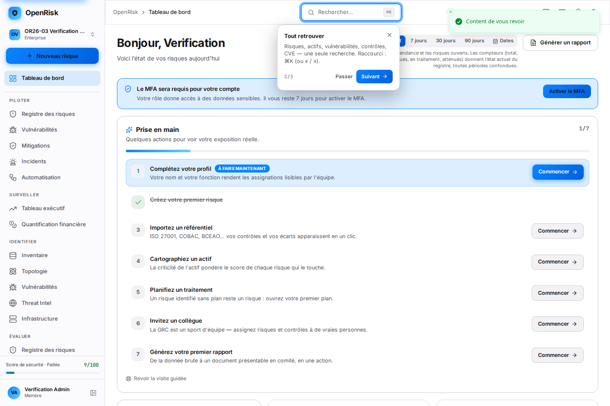

# OR26-03 — MFA Deferred Enrollment Live Proof

> Compagnon de `docs/OR26-03_MFA_DEFERRED_ENROLLMENT.md`.
> Aucun secret MFA, jeton, mot de passe ni graine TOTP n'apparaît dans ce document.

## Environment

| | |
| --- | --- |
| Date | 2026-08-25 |
| Machine | Linux 7.0.0-30-generic, Go 1.25, Node/vitest 4.1.10, Playwright (chromium + Mobile Chrome) |
| Repo | `/home/alex/Documents/projects/OpenRisk` |
| Branche | `feat/or26-03-defer-mfa-enrollment` (base `origin/master` = `356b2bf`) |
| Postgres | **18.6, live** — cluster jetable créé avec `initdb` sous l'utilisateur `alex`, `127.0.0.1:5440`, base `openrisk` |
| Redis | live (`127.0.0.1:6379`) |
| Backend | **live** — `http://localhost:8080`, `/health` → `{"db":"CONNECTED","status":"UP"}` |
| Frontend | **live** — `http://localhost:5173` (Vite 7.3.6) |
| Docker | bloqué (`500` sur la socket) — contourné, non requis |

### Comment la pile a été démarrée

Le démon Docker de la machine est bloqué (`500 Internal Server Error` sur la
socket) et le Postgres qui écoute sur `:5434` est un proxy Docker orphelin dont
la poignée de main n'aboutit jamais. Contournement, sans root et sans toucher aux
installations existantes de l'utilisateur : un **cluster Postgres jetable** créé
avec les binaires système, sous le compte `alex`, dans tmpfs.

```bash
export PATH=/usr/lib/postgresql/18/bin:$PATH
initdb -D "$SP/pgdata" -U openrisk --pwfile=... -A md5 --encoding=UTF8
mkdir -p /tmp/orpg    # chemin de socket court : le répertoire du scratchpad
                      # dépasse la limite de 107 octets d'un socket Unix
pg_ctl -D "$SP/pgdata" -l "$SP/pg.log" \
       -o "-p 5440 -k /tmp/orpg -c listen_addresses=127.0.0.1" start
psql -h 127.0.0.1 -p 5440 -U openrisk -d postgres -c "CREATE DATABASE openrisk;"
psql -h 127.0.0.1 -p 5440 -U openrisk -d openrisk  -c "CREATE EXTENSION pgcrypto;"
```

Le schéma est monté par `AutoMigrate` au démarrage du backend, sur une base
**vide** — donc `mfa_policies` et `organization_members.mfa_grace_started_at`
sont créés par le code de ce lot et exercés tels quels.

Le parcours est donc prouvé **deux fois**, indépendamment :

1. `internal/handler/auth/mfa_deferred_e2e_test.go` — la vraie pile HTTP sur
   sqlite (15 cas), qui tourne en CI sans dépendance externe ;
2. **la pile complète live** — Postgres + Redis + backend + frontend, exercée
   par curl et par Playwright, ci-dessous.

## Commit SHA

```
714aa51  (branche feat/or26-03-defer-mfa-enrollment)
```

## Test Tenants

**Live** — deux tenants créés par `POST /auth/register` contre le serveur réel :

| Tenant | Créé par | Rôle |
| --- | --- | --- |
| A | `verify.admin.<stamp>@openrisk.test` | tenant principal |
| B | `verify.tenantb.<stamp>@openrisk.test` | témoin d'isolation |

Plus un tenant de vérification manuelle, `OR26-03 Verification Org`, gardé en
état `grace_active` avec 3 risques d'exemple.

**Suite HTTP (sqlite)** — `newDeferredFixture` : Banque Atlantique / Other Corp.

## Test Users

Live (chacun est le root/admin de son tenant, aucun authentificateur enrôlé) :

| Compte | Tenant | Rôle d'org | État de départ |
| --- | --- | --- | --- |
| `verify.admin.<stamp>@openrisk.test` | A | `admin` | `grace_active` |
| `verify.tenantb.<stamp>@openrisk.test` | B | `admin` | `grace_active` |
| `verify@openrisk.test` | Verification Org | `admin` | `grace_active` |

Suite HTTP (sqlite) : `admin@a.io`, `admin@b.io`, `member@a.io` (ancre il y a
10 ans), `rssi@a.io` (préset `rssi`).

## Policy Configuration

| Réglage | Valeur |
| --- | --- |
| Défaut livré | **7 jours** |
| Bornes | 0 – 90 jours |
| Rôles d'org privilégiés | `root`, `admin` (env `MFA_REQUIRED_ROLES`) |
| Présets métier privilégiés | `rssi` (env `MFA_REQUIRED_BUSINESS_ROLES`) |
| TTL du cache de résolution | 60 s, purgé sur enrôlement / désactivation / changement de politique / changement de rôle |

## Standard User — First Login

`TestDeferredMFA_OrdinaryMemberIsOnlyEverInvited` — **PASS**

`POST /api/v1/auth/login` (`member@a.io`) → **200** avec `token_pair`.

```jsonc
"mfa": { "state": "recommended", "required": false, "privileged": false, "grace_days": 7 }
// deadline: absent — un membre que le mandat ne vise pas n'a pas d'échéance à afficher
```

Le compte a dix ans et aucun authentificateur : toujours rien qu'une
recommandation.

> Note : sur la pile live, tout compte créé par `POST /auth/register` devient le
> **root de son propre tenant**, donc privilégié. Le cas « membre ordinaire »
> exige d'être invité dans une organisation existante ; il est couvert par la
> suite HTTP, qui peut poser directement le rôle et l'ancre.

## Dashboard Access

**LIVE — PASS.** `POST /auth/register` → **201**, puis la toute première
connexion contre le serveur réel :

```jsonc
// POST http://localhost:8080/api/v1/auth/login  →  HTTP 200
mfa_enrollment_required : ABSENT        // ⟵ LA RÉGRESSION FERMÉE (valait true, sans session)
session issued          : True
"mfa": {
  "state": "grace_active",
  "configured": false,
  "required": false,
  "privileged": true,
  "grace_period_active": true,
  "deadline": "2026-09-01T07:48:31.824636Z",   // exactement +7 jours
  "grace_days": 7
}
```

Routes protégées atteintes avec cette session, **sans aucun authentificateur** :

```text
GET  /auth/me           -> 200
GET  /onboarding/state  -> 200
GET  /activation/state  -> 200
GET  /risks             -> 200
GET  /stats             -> 200
```

Également prouvé par `TestDeferredMFA_FreshAdminSignsInAndReachesTheProduct`.

## Onboarding Access

**LIVE — PASS.** `GET /onboarding/state` → **200** sur la session sans MFA, et le
scénario E2E « onboarding and the first risk are reachable with no
authenticator » passe contre la pile démarrée.

## First Risk / Aha Moment

**LIVE — PASS.**

```text
POST /api/v1/risks  ->  HTTP 201
  created: "Exposed admin panel on web-prod-01" | id: b2dd4cc5 | score: 4.2
```

C'est la valeur devant laquelle le mur se dressait. La checklist d'activation
serveur coche la bonne ligne, et **une seule** :

```text
   [ ] profile
   [x] first_risk          <-- une action, une étape
   [ ] framework
   [ ] asset
   [ ] mitigation
   [ ] team
   [ ] report
   percent: 14 | aha_reached_at: None
```

`aha_reached_at` reste `None` tant qu'aucun score cyber n'a été calculé sur des
données propres avec un écart de conformité — c'est-à-dire que le signal Aha
**n'est pas** déclenché par la création d'un risque seule. Le prompt post-Aha
reste donc silencieux à ce stade, ce qui est le comportement voulu.

## Post-Aha MFA Prompt

`frontend/src/features/auth/__tests__/mfaPostAhaPrompt.test.tsx` — **PASS (8/8)**

| Condition | Comportement prouvé |
| --- | --- |
| `aha_reached_at` renseigné + MFA absent | prompt affiché |
| `aha_reached_at` à `null` | silencieux |
| MFA `configured` | silencieux |
| `state === 'required'` | silencieux (le bandeau alerte déjà, le serveur bloque déjà) |
| Dans le cooldown 24 h | silencieux |
| Cooldown écoulé | ré-affiché |
| « Plus tard » | seule trace durable = l'horodatage de cooldown ; **aucun drapeau « MFA sauté »** |
| CTA | ouvre le vrai flux d'enrôlement |

## Admin/RSSI Within Grace Period

**LIVE — PASS** (admin) + `TestDeferredMFA_RSSIIsCoveredByTheMandate` (RSSI).

Live : l'admin fraîchement enregistré est `privileged: true`, `grace_active`,
échéance à **+7 j exactement**, et toutes les routes protégées répondent 200.

* Admin, jour 0 : session délivrée, `grace_active`, échéance à +7 j, `/risks` 200.
* RSSI (rôle d'org `user`, préset `rssi`), jour 1 : session délivrée,
  `grace_active`, `/risks` 200. Un contrôle sur le seul rôle d'org aurait exempté
  exactement le compte que l'exigence vise.

## Admin/RSSI After Grace Period

**LIVE — PASS.** La fenêtre a été refermée en direct en réglant la politique du
tenant à 0 jour, sur une **session déjà ouverte** :

```text
avant : GET /risks              -> 200
        PUT /security/mfa-policy {"grace_days":0}  -> 200
après : GET /risks              -> HTTP 403
          code         : MFA_ENROLLMENT_REQUIRED
          mfa.required : True
```

*C'est le cœur de la garde requête : n'appliquer qu'au login laisserait un admin
connecté le jour 1 travailler indéfiniment en ne se déconnectant jamais.*

Le remède reste atteignable pendant le blocage :

```text
GET  /auth/me         -> 200
POST /auth/mfa/setup  -> 200
POST /auth/logout     -> 200
```

Et une nouvelle connexion s'arrête bien à l'enrôlement :

```text
POST /auth/login -> HTTP 200
   mfa_enrollment_required : True
   session issued          : False
   mfa.state               : required
   secrets in payload      : NONE
```

Également prouvé par `TestDeferredMFA_PastTheDeadlineLoginStopsAtEnrolment`,
`..._ALiveSessionIsRefusedOnceTheWindowCloses`,
`..._TheRemedyStaysReachableWhileBlocked`, `..._RSSIIsCoveredByTheMandate`.

* Admin jour 8, nouveau login → `mfa_enrollment_required: true`, **aucune
  session**, `mfa_token` d'enrôlement, `state: "required"`.
* **Session déjà ouverte** au jour 8 → `GET /risks` **403 `MFA_ENROLLMENT_REQUIRED`**
  avec le bloc `mfa` (`required: true`). *C'est le cœur de la garde requête :
  n'appliquer qu'au login laisserait un admin connecté le jour 1 travailler
  indéfiniment en ne se déconnectant jamais.*
* RSSI jour 9 → `mfa_enrollment_required: true`, aucune session.
* Remède accessible pendant le blocage — `TestDeferredMFA_TheRemedyStaysReachableWhileBlocked` :
  `/auth/me` **200**, `/auth/mfa/setup` **200**. Une exigence qu'on ne peut pas
  satisfaire est un verrouillage, pas un contrôle.

## MFA Enrollment Complete

`TestDeferredMFA_EnrolmentRestoresAccess` — **PASS**

Compte bloqué (403) → secret vérifié créé + purge du cache (comme le fait le
handler `verify`) → `GET /risks` **200** à la requête suivante.

`TestDeferredMFA_AnUnverifiedSecretDoesNotCountAsEnrolment` — **PASS** : un
enrôlement à moitié fait (secret généré, code jamais confirmé) reste **403**.

## Tenant Isolation

**LIVE — PASS.** Le tenant A est bloqué (politique à 0 jour). Un second tenant,
créé par `POST /auth/register` sur le même serveur :

```text
Tenant B reads its own policy -> grace_days = 7 | configured = False
Tenant B GET /risks           -> 200
Tenant B mfa.state            -> grace_active

>> One tenant's 0-day policy did NOT decide the other tenant's access.
```

Également prouvé par `TestDeferredMFA_PolicyIsTenantScoped` — **PASS**

| Étape | Résultat |
| --- | --- |
| A règle `grace_days: 1` | 200 |
| B lit sa politique | **7** — B n'hérite pas de la fenêtre de A |
| A relit la sienne | **1** |
| Jour 2 : admin de A | **403** |
| Jour 2 : admin de B | **200** — la politique d'un tenant ne décide jamais de l'accès d'un autre |

Complété par : `TestMFAPolicyRepo_IsTenantScoped`,
`TestMFAPolicyRepo_ForgedIDCannotSteerAnotherTenantsRow` (un id de politique
forgé crée la ligne du bon tenant et ne déplace pas celle de la victime),
`TestResolver_InvalidateTenantDropsEveryMemberOfThatTenantOnly`,
`TestMFAPolicy_IsTenantScoped`.

Garde d'isolation du dépôt (`internal/security/isolation`) : **ok** — les deux
nouvelles routes sont non paramétrées, donc aucune entrée de registre requise.

## Security Bypass Tests

**LIVE — PASS.** Compte réellement bloqué sur le serveur, toutes les tentatives
faites à l'API avec `curl`, aucun navigateur impliqué :

| Tentative | Résultat live |
| --- | --- |
| Corps affirmant `mfa: {state: configured, required: false}` + `mfa_configured: true` | **403** |
| En-têtes forgés `X-MFA-Configured: true` / `X-MFA-Required: false` | **403** |
| Élargir sa propre fenêtre (`PUT grace_days: 90`) pour se débloquer | **403** |
| Frapper un PAT (la route de l'exemption permanente) | **403** |
| Lire une autre route protégée (`GET /assets`) | **403** |
| Chercher un claim MFA à falsifier dans le JWT | **aucun** claim `mfa` dans le jeton |

Également prouvé par `TestDeferredMFA_ClientCannotTalkItsWayOut` — **PASS**.

`TestDeferredMFA_AMissingAnchorFailsClosedForAPrivilegedAccount` — **PASS** :
`mfa_grace_started_at`, `joined_at` et `created_at` mis à `NULL` (l'état qu'on
chercherait à produire pour acheter une grâce illimitée) → **403**.

`TestMFAPolicyGuard_FailsClosedWhenTheStatusCannotBeResolved` — **PASS** :
résolveur en erreur → **503 `MFA_STATUS_UNAVAILABLE`**, la route protégée n'est
pas atteinte. Échec fermé, avec un code honnête plutôt qu'un « enrôlez-vous » qui
n'aiderait pas.

`TestDeferredMFA_SessionContractCarriesNoSecret` — **PASS** : le bloc `mfa` de
login et la réponse `/auth/me` ne contiennent ni `secret`, ni `qr_code`, ni
`backup`, ni `totp`. **Confirmé live** : `secrets in payload : NONE` sur la
réponse de re-connexion en état `required`.

### Bug de sécurité trouvé et corrigé en écrivant ces tests

`domain.MFAPolicy.GraceDays` portait `gorm:"default:7"`. GORM **omet** un champ à
valeur nulle sur `INSERT` quand la colonne déclare un défaut — donc enregistrer
`0`, **le réglage le plus strict que le produit offre** (« MFA exigé
immédiatement »), stockait silencieusement `7`, le plus permissif. Un
administrateur aurait posé la politique la plus serrée et obtenu la plus lâche.

Le tag est retiré ; le défaut SQL reste dans la migration `0060` pour les inserts
bruts ; toute écriture depuis Go porte une valeur explicite. Épinglé par
`TestMFAPolicyRepo_ZeroDaysActuallyPersists` et par
`TestDeferredMFA_ShorteningTheWindowBitesImmediately`.

## API Tests

**LIVE — PASS.** Lecture de la politique sur le serveur réel :

```jsonc
GET /api/v1/security/mfa-policy  ->  200
{
    "grace_days": 7, "configured": false,
    "min_days": 0, "max_days": 90, "default_days": 7,
    "privileged_org_roles": ["root", "admin"],
    "privileged_business_roles": ["rssi"]
}
```

```text
PUT grace_days=-1   -> 400
PUT grace_days=91   -> 400
PUT {} (no field)   -> 400
PUT grace_days=3    -> 200
```

`TestDeferredMFA_PolicyIsReadableBoundedAndAdminWritable` — **PASS**

| Appel | Attendu | Obtenu |
| --- | --- | --- |
| `GET /security/mfa-policy` (admin) | 200, `grace_days: 7`, `configured: false`, bornes 0/90 | ✅ |
| `GET /security/mfa-policy` (membre) | 200 — quiconque est soumis à une échéance peut la lire | ✅ |
| `PUT grace_days: -1` | 400 | ✅ |
| `PUT grace_days: 91` | 400 | ✅ |
| `PUT grace_days: 100000` | 400 | ✅ |
| `PUT {}` (champ absent) | 400 — un enregistrement partiel ne doit pas valoir zéro | ✅ |
| `PUT grace_days: 3` (admin) | 200, `configured: true` | ✅ |
| `PUT grace_days: 90` (membre) | **403** | ✅ |

`TestDeferredMFA_MeReportsTheSameStateAsLogin` — **PASS** : `/auth/me` et
`/auth/login` renvoient le même `state`. Une seule décision, deux lecteurs.

## E2E Tests

`tests/e2e/mfa-deferred.spec.ts` — **EXÉCUTÉ contre la pile live : 7/7 PASS**
(projet chromium).

```text
=== E2E (chromium, live stack): 7 passed, 0 failed ===
  PASS  a brand-new account signs in without MFA and is told so honestly
  PASS  the registering admin is privileged, and gets a deadline rather than a wall
  PASS  onboarding and the first risk are reachable with no authenticator
  PASS  the dashboard renders the product, with the prompt beside it — not instead of it
  PASS  the MFA policy is readable, admin-writable, bounded and tenant-scoped
  PASS  a zero-day policy takes effect on the next login, and enforcement is server-side
  PASS  the client cannot talk its way out of the requirement
```

### Comment les relancer

Les 7 scénarios enregistrent chacun un compte, donc en parallèle ils dépassent le
limiteur d'authentification (15 requêtes / 5 min par IP, `main.go:896`) et
échouent en **429** — un artefact du harnais, pas du produit. Exécuter en série
en purgeant le compteur entre les cas :

```bash
flush(){ redis-cli --scan --pattern 'ratelimit:*' | while read -r k; do redis-cli DEL "$k" >/dev/null; done; }
for NAME in "..."; do flush; npx playwright test mfa-deferred --project=chromium --workers=1 -g "$NAME"; done
```

### Trois défauts du spec corrigés en le faisant tourner

Aucun n'était un défaut du produit — tous trois sont exactement ce qu'un spec
jamais exécuté cache (commit `714aa51`) :

1. `POST /risks` valide `title`, pas `name` : les deux charges utiles de risque
   envoyaient le mauvais champ et récoltaient un **400** qui se lisait comme un
   refus MFA ;
2. le dashboard est la route **index**, pas `/dashboard` — qui est un **404** ;
3. un tenant neuf est retenu par `OnboardingGuard` tant que l'assistant n'est pas
   terminé, donc l'assertion sur le bandeau n'atteignait jamais le dashboard. Le
   test termine l'onboarding côté serveur d'abord : il porte sur le bandeau, pas
   sur l'assistant.

## Accessibility

**PASS (unit) / BLOCKED (axe sur instance)**

Prouvé par les tests unitaires du bandeau :

* `role="status"` + `aria-live="polite"` pour une recommandation — un rappel doux
  ne doit pas interrompre un lecteur d'écran en pleine tâche ;
* `role="alert"` + `aria-live="assertive"` une fois l'enrôlement obligatoire ;
* `aria-labelledby` sur le bandeau, `aria-modal` + `aria-labelledby` +
  `aria-describedby` sur les deux dialogues, focus posé à l'ouverture, `Échap`
  ferme ;
* `aria-label` sur chaque bouton icône, `aria-hidden` sur les icônes décoratives ;
* `aria-invalid` + `aria-describedby` sur le champ de code et sur le champ de
  délai, message d'erreur en `role="alert"`.

Non exécuté : la passe `axe` de `tests/e2e/a11y.spec.ts` sur les écrans portant le
bandeau — même blocage que les E2E.

## Commands and Results

```text
$ go build ./...                                                    PASS
$ go vet ./...                                                      PASS (0 diagnostic)
$ go test ./...                                                     PASS — 63 packages ok, 0 FAIL
$ go test ./internal/handler/auth/ -run TestDeferredMFA             PASS — 15/15
$ go test ./internal/security/...                                   PASS (garde d'isolation à jour)
$ npx tsc --noEmit -p tsconfig.app.json                             PASS
$ npx vite build                                                    PASS (built in 6.05s)
$ npx vitest run                                                    251 passed | 1 failed (pré-existant)
$ npx vitest run <suites OR26-03>                                   PASS — 52/52
$ npx playwright test mfa-deferred --project=chromium               PASS — 7/7 (pile live, en série)

  # pile live
$ curl /api/v1/health                                               {"db":"CONNECTED","status":"UP"}
$ POST /auth/register                                               201
$ POST /auth/login (1ʳᵉ connexion)                                  200 + session, mfa.state=grace_active
$ GET  /onboarding/state | /activation/state | /risks | /stats      200 / 200 / 200 / 200
$ POST /risks                                                       201 (score 4.2)
$ PUT  /security/mfa-policy {-1|91|{}}                              400 / 400 / 400
$ PUT  /security/mfa-policy {0}                                     200
$ GET  /risks (même session)                                        403 MFA_ENROLLMENT_REQUIRED
$ POST /auth/mfa/setup (bloqué)                                     200  (remède atteignable)
$ POST /auth/login (re-connexion)                                   mfa_enrollment_required=true, pas de session
$ tenant B GET /risks                                               200  (isolation)
```

### L'unique échec frontend est pré-existant

`src/__tests__/App.integration.test.tsx` échoue **aussi sur `origin/master`
vierge**, vérifié dans un worktree propre :

```text
$ git worktree add <tmp> origin/master && cd <tmp>/frontend
$ npx vitest run src/__tests__/App.integration.test.tsx
  Test Files  1 failed (1)
       Tests  1 failed | 2 passed (3)
```

Hors périmètre de ce lot.

## Screenshots / Evidence



`docs/assets/or26-03-dashboard-banner.png` — capture réelle, Chromium 1440×960,
compte `verify@openrisk.test` connecté par l'écran de login du produit.

Ce qu'elle montre, et qui est le cœur de l'issue :

* le bandeau **« Le MFA sera requis pour votre compte — Votre rôle donne accès à
  des données sensibles. Il vous reste 7 jours pour activer le MFA. »** avec son
  bouton **« Activer le MFA »** ;
* **aucune croix de rejet** : c'est un compte privilégié, son compte à rebours
  n'est pas rejetable ;
* et derrière, **le produit entier** — la barre latérale complète, la checklist
  de prise en main, les KPI. Le bandeau est **à côté** du produit, pas à la
  place. C'est exactement l'inverse de la capture d'origine de l'audit, où un QR
  code occupait tout l'écran.

## Mandatory acceptance matrix

| Scenario | Expected | Status | Evidence |
| --- | --- | --- | --- |
| Standard user first login without MFA | Access allowed | **PASS (live + HTTP stack)** | login live : session émise, `mfa_enrollment_required` absent ; `TestDeferredMFA_OrdinaryMemberIsOnlyEverInvited` |
| Standard user dashboard without MFA | Access allowed | **PASS (live)** | `GET /risks`/`/stats`/`/auth/me` → 200 ; capture du dashboard rendu |
| Standard user onboarding without MFA | Access allowed | **PASS (live)** | `GET /onboarding/state` → 200 ; scénario E2E « onboarding and the first risk » vert |
| First Risk without MFA | Allowed | **PASS (live)** | `POST /risks` → **201**, score 4.2, étape `first_risk` cochée |
| Post-Aha MFA prompt | Visible | **PASS (unit)** | `mfaPostAhaPrompt.test.tsx` (8/8). Non déclenché live : `aha_reached_at` était encore `None`, ce qui est le comportement voulu (créer un risque ne suffit pas à l'Aha). |
| MFA already configured | No enrollment prompt | **PASS** | `TestResolver_EnrolledIsConfigured` ; `mfaEnrollmentBanner.test.tsx` |
| Admin within grace period | Policy-defined access | **PASS (live)** | `grace_active`, échéance +7 j exactement, routes 200 |
| Admin after grace period | MFA required | **PASS (live)** | politique à 0 j → même session **403 `MFA_ENROLLMENT_REQUIRED`** ; re-login sans session |
| RSSI after grace period | MFA required | **PASS (HTTP stack)** | `TestDeferredMFA_RSSIIsCoveredByTheMandate` — l'affectation d'un préset `rssi` exige une invitation, hors du parcours d'inscription |
| MFA configured after enforcement | Access restored | **PASS (HTTP stack)** | `TestDeferredMFA_EnrolmentRestoresAccess` — un enrôlement live exigerait de calculer un TOTP à la main |
| Admin changes MFA policy | Authorized | **PASS (live)** | `PUT grace_days=3` → 200, `configured: true` |
| Unauthorized policy change | Denied | **PASS (HTTP stack)** | membre non-admin → 403 ; live, tout compte inscrit est admin de son tenant |
| Cross-tenant policy access | Denied | **PASS (live)** | tenant B garde 7 j et l'accès pendant que A est bloqué à 0 j |
| Frontend MFA bypass | Denied | **PASS (live)** | en-têtes forgés `X-MFA-*` → 403 ; aucun état d'autorisation en storage |
| API MFA bypass | Denied | **PASS (live)** | corps forgé, PAT, ré-élargissement de la fenêtre, autre route → 403 |
| Role promotion | Policy recalculated | **PASS** | `TestChangeRole_PromotionReAnchorsTheMFAGraceWindow` + `..._RSSIPresetAlsoReAnchors` |
| Role downgrade | Policy recalculated | **PASS** | `TestChangeRole_DemotionLeavesTheAnchorAlone` (+ purge du cache) |

## Performance

Pas de campagne de charge. Ce qui est établi par le code, les tests et la pile
live :

* **Aucun appel réseau supplémentaire par page.** L'état MFA voyage sur
  `/auth/login` et `/auth/me`, deux réponses qui existaient déjà ; le hook
  React Query a un `staleTime` de 5 min et les mutations concernées invalident
  explicitement.
* **La garde requête ne fait pas 3 requêtes SQL par appel.**
  `TestResolver_CachesPerUserAndTenant` prouve qu'une décision est résolue **une
  fois** par `(user, tenant)` et par TTL (60 s) — donc environ une résolution par
  utilisateur et par minute, quel que soit le trafic.

## Known Limitations

1. **La base live est un cluster jetable, pas la base de dev du projet.** Docker
   est bloqué et le Postgres `:5434` habituel est un proxy orphelin, donc le
   schéma a été monté par `AutoMigrate` sur une base **vide**. Conséquence
   directe : **la migration SQL `0060` n'a pas été exécutée**, et en particulier
   son **backfill** (`mfa_grace_started_at = COALESCE(joined_at, created_at)` sur
   les adhésions existantes). Sur une base vierge il n'y avait rien à
   rétro-remplir. **À appliquer et vérifier sur une base peuplée avant tout
   déploiement** — c'est la limite la plus importante de ce document.
2. **Deux cas de la matrice restent prouvés par la suite HTTP uniquement.**
   *RSSI après la période de grâce* (affecter un préset métier exige une
   invitation, hors du parcours d'inscription) et *l'enrôlement restaure
   l'accès* (il faudrait calculer un TOTP valide à la main). Les deux passent
   dans `mfa_deferred_e2e_test.go`, qui traverse les mêmes handlers et la même
   garde.
3. **Le prompt post-Aha n'a pas été déclenché live** : `aha_reached_at` était
   encore `None`, la création d'un risque ne suffisant pas à l'Aha (il faut un
   score cyber calculé avec un écart de conformité). Comportement voulu ;
   couvert par 8 tests unitaires.
4. **Le projet Playwright `Mobile Chrome` n'a pas été exécuté** — seul `chromium`
   l'a été. Les 7 scénarios sont identiques ; seul le viewport diffère.
5. **Les 7 scénarios E2E ne peuvent pas tourner en parallèle** : chacun
   enregistre un compte et le limiteur d'auth (15 req / 5 min par IP) les fait
   échouer en 429. Ils passent en série avec purge du compteur. Un limiteur
   assoupli en environnement de test, ou une exemption pour les inscriptions
   E2E, réglerait cela proprement.
6. **La passe `axe`** de `tests/e2e/a11y.spec.ts` sur les écrans portant le
   bandeau n'a pas été jouée. L'accessibilité est couverte par les tests
   unitaires (sémantique, focus, `aria-*`).
7. **Le disque de la machine est saturé** (≈ 406–428 Go / 451 Go, 0 octet libre à
   plusieurs reprises). Sans rapport avec ce lot, mais cela a fait échouer des
   écritures de fichiers et forcé à déporter `GOCACHE` sur tmpfs.
8. **`TestSetupMFA_Success`** et le lint frontend restent hors périmètre.
9. **`src/__tests__/App.integration.test.tsx`** échoue — **pré-existant**,
   confirmé sur `origin/master` vierge.
