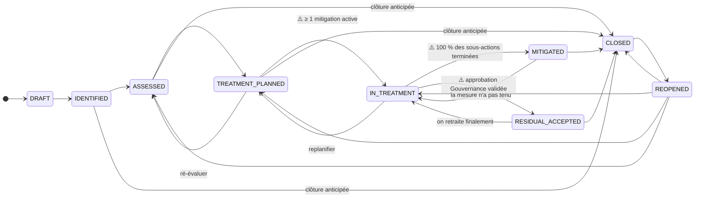

# Cycle de vie d'un risque

> Ce document décrit **le seul** cycle de vie d'un risque dans OpenRisk : les états,
> ce qui autorise de passer de l'un à l'autre, et ce qui bloque quand ça bloque.
> Il fait autorité — le backend refuse toute transition qui n'y figure pas.

## Pourquoi un seul cycle de vie

Jusqu'à la migration `0045`, **deux** champs prétendaient chacun dire où en était un
risque, sans que rien ne les réconcilie :

| Champ | Vocabulaire |
|---|---|
| `status` | `open` · `in_progress` · `mitigated` · `accepted` · `closed` (+ un jeu hérité en majuscules) |
| `lifecycle_phase` | ISO 31000 : `identified` · `analyzed` · `evaluated` · `treated` · `monitored` · `closed` |

Un risque pouvait donc afficher « traité » tout en étant en phase « traitement », avec
**aucune mitigation terminée**. C'est le bug « cycle de vie flou ».

Désormais, **`lifecycle_state` est la seule source de vérité écrite**. `status` et
`lifecycle_phase` sont **dérivés** à chaque écriture (`domain.Risk.SetState`) et
conservent leurs colonnes : tous les filtres, pastilles et tableaux de bord
existants continuent de fonctionner, mais plus personne ne peut les faire diverger.

## Le graphe



⚠️ = transition **gardée** : le serveur vérifie une condition avant de l'autoriser.

## Les états

| État | Signification | `status` dérivé | `lifecycle_phase` dérivée |
|---|---|---|---|
| `draft` | Saisi, pas encore versé au registre | `DRAFT` | `identified` |
| `identified` | Au registre, contexte décrit | `open` | `identified` |
| `assessed` | Probabilité × impact chiffrés | `open` | `analyzed` |
| `treatment_planned` | Une stratégie de traitement est choisie | `open` | `evaluated` |
| `in_treatment` | Le travail de mitigation est en cours | `in_progress` | `treated` |
| `residual_accepted` | Le risque résiduel est formellement accepté | `accepted` | `monitored` |
| `mitigated` | Le traitement est terminé | `mitigated` | `monitored` |
| `closed` | Résolu / sans objet | `closed` | `closed` |
| `reopened` | Revenu après clôture | `open` | `identified` |

## Les trois gardes

Elles sont appliquées **côté serveur**, dans
`internal/application/risk/transition_state.go`. Ce n'est pas un détail : elles
étaient auparavant « appliquées » par un frontend qui proposait les boutons qu'il
voulait — c'est ainsi qu'un risque a pu devenir `MITIGATED` avec deux sous-actions
encore ouvertes.

### 1. `IN_TREATMENT` exige ≥ 1 mitigation active

Sans elle, « en traitement » est une affirmation sans rien derrière. Une mitigation
`CANCELLED` ne compte pas.

> *Ce risque n'a aucune mitigation active. Créez-en une avant de démarrer le traitement.*

### 2. `MITIGATED` exige 100 % des sous-actions terminées

**Toutes** les mitigations actives du risque, pas seulement une. Un plan sans
aucune sous-action compte comme terminé : la garde porte sur le travail restant,
pas sur l'existence d'une checklist.

C'est cette garde qui fait du cycle de vie et du plan de mitigation **un seul flux** :
on ne coche pas « traité » d'un côté pendant que le plan reste ouvert de l'autre.

> *2 sous-action(s) restante(s) sur la mitigation MIT-14*

### 3. `RESIDUAL_ACCEPTED` exige une approbation Gouvernance validée

Accepter un risque résiduel est une décision, pas une liste déroulante. Il faut une
`ApprovalRequest` de type `risk_acceptance` portant sur ce risque et **approuvée**.
Une demande encore en attente n'est pas une approbation — le message la nomme pour
qu'on sache laquelle relancer.

> *La demande d'approbation `a1b2c3d4` est encore en attente. Le risque résiduel ne peut être accepté qu'une fois validé par la Gouvernance.*

### Une garde non vérifiable **bloque**

Si la source qui répond à une garde est indisponible, la transition est **refusée**,
pas supposée. Dans un outil de sécurité, l'échec honnête est l'échec sûr.

## L'API

### `POST /api/v1/risks/:id/transition`

```jsonc
{ "to": "in_treatment", "comment": "plan validé en comité" }
```

- `to` : l'état cible. Les majuscules du schéma (`IN_TREATMENT`) sont acceptées.
- `comment` : optionnel, ≤ 1000 caractères, versé à la piste d'audit.
- Les anciennes clés `phase` / `note` restent acceptées et sont traduites vers
  l'état correspondant (la route préexiste à ce changement).

Réponses :

| Code | Quand |
|---|---|
| `200` | Transition appliquée ; le risque complet est renvoyé |
| `400` | Arête inexistante, état inconnu, no-op, **ou garde non satisfaite** (le message *est* le blocage) |
| `404` | Risque inconnu **ou appartenant à un autre tenant** |

### `GET /api/v1/risks/:id/transitions`

Ce que rend `<LifecycleStepper>` : l'état courant, l'étape suivante naturelle, et
**toutes** les cibles atteignables — y compris celles qui sont bloquées, avec la
raison. Les options bloquées sont **renvoyées plutôt que masquées** : un utilisateur
qui ne voit pas l'étape suivante n'a aucun moyen d'apprendre ce qu'il doit faire.

```jsonc
{
  "current": "in_treatment",
  "current_label": "En traitement",
  "next": "mitigated",
  "next_label": "Traité",
  "blocked_reason": "2 sous-action(s) restante(s) sur la mitigation MIT-14",
  "step_index": 4,
  "step_count": 7,
  "options": [
    {
      "to": "mitigated",
      "label": "Traité",
      "allowed": false,
      "reason": "2 sous-action(s) restante(s) sur la mitigation MIT-14",
      "guard": "subactions_complete",
      "is_forward": true
    },
    {
      "to": "residual_accepted",
      "label": "Risque résiduel accepté",
      "allowed": false,
      "reason": "L'acceptation du risque résiduel exige une approbation Gouvernance validée. Soumettez-en une d'abord.",
      "guard": "governance_approval",
      "is_forward": true
    },
    { "to": "treatment_planned", "label": "Traitement planifié", "allowed": true, "is_forward": false }
  ]
}
```

Le champ `guard` sert à proposer **la bonne sortie** (ouvrir la mitigation, soumettre
l'approbation) au lieu d'une impasse.

## Migration des données existantes

`0045` renseigne `lifecycle_state` à partir des deux anciens champs. **Le `status`
l'emporte sur la phase** quand ils se contredisent : une résolution (« mitigated »,
« accepted », « closed ») est une affirmation plus forte qu'une phase, et c'est celle
sur laquelle les utilisateurs ont agi dans l'interface.

La migration **re-dérive ensuite** `status` et `lifecycle_phase` depuis l'état
calculé : les lignes qui se contredisaient avant cessent de se contredire après.
C'est le seul endroit où l'incohérence historique est réparée ; ensuite, `SetState`
les maintient alignés.

Le `down.sql` supprime la colonne mais **ne restaure pas** l'incohérence : ce serait
une régression, pas un retour arrière.

## Où c'est dans le code

| Quoi | Où |
|---|---|
| États, arêtes, gardes, dérivations | `backend/internal/domain/risk_state.go` |
| Application des gardes, API des transitions | `backend/internal/application/risk/transition_state.go` |
| Adaptateurs des gardes (mitigations, approbations) | `backend/cmd/server/lifecycle_wiring.go` |
| Routes | `POST /risks/:id/transition`, `GET /risks/:id/transitions` (`cmd/server/main.go`) |
| Tests du graphe (produit croisé complet) | `backend/internal/domain/risk_state_test.go` |
| Tests des gardes | `backend/internal/application/risk/transition_state_test.go` |
| Stepper | `frontend/src/features/risks/LifecycleStepper.tsx` |
